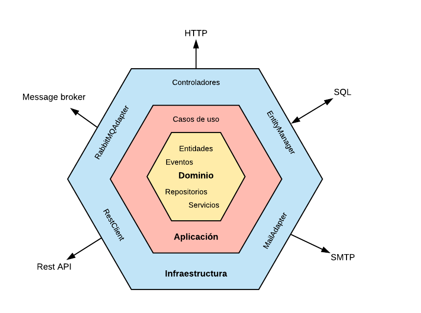

# Product sort Project

This project is a service built with **Spring Boot 3.4+** and **Java 21**. It uses a hexagonal architecture organized into three main modules: **Application**, **Domain**, and **Infrastructure**. This service calculates a score for each product based on the provided criteria (such as sales units and stock ratio) and returns the products ranked by the calculated score.

## Architecture

The hexagonal architecture has been chosen to promote separation of concerns and facilitate code maintainability and scalability. The modules are organized as follows:

1. **Application**: Contains the application logic and use cases. It handles interactions with the domain and serves as the entry point for service operations.

2. **Domain**: Defines domain objects and business rules. It is independent of infrastructure and application, ensuring flexibility and maintainability.

3. **Infrastructure**: Manages interactions with external systems, such as databases, APIs, and network services. It implements the interfaces defined in the application module and provides concrete solutions for persistence and other technical functionalities.



## Dependencies

The project uses several key dependencies to enhance its functionality and facilitate development:

- **Lombok**: Eases code writing by reducing the amount of boilerplate code needed, such as getters, setters, and constructors.

- **MapStruct**: Provides a simple way to map between objects, which is useful for converting between domain entities and DTOs (Data Transfer Objects).

- **Spring Data JPA**: Facilitates interaction with databases through the implementation of repositories and entity management.

## API First

This project follows an **API First** approach, meaning that the API definition is created before the implementation of the code. This approach allows development teams and stakeholders to collaborate on the API specification, ensuring that everyone is aligned on the requirements and expected behavior.

The API specification can be found in the file:

- **[`product-api.yaml`](./src/main/resources/open-api/product-api.yaml)**: This file contains the API definition, including endpoints, parameters, and expected responses.


## How to Run the Project

### 1. Clone the Repository

```bash
git clone https://github.com/jhonatanMD/product-ranking-service.git
cd product-ranking-service
```

### 2. Build the Project

Run a clean build of the project:

```bash
  mvn clean install
```

### 3. Build Docker Images

Build all necessary images without using cache:

```bash
  docker-compose build --no-cache
```

### 6. Load Initial Data

The project includes an initial data load file that can be used to populate the H2 database. Ensure that the data file is correctly configured and available in the appropriate directory (**[`data.sql`](./infrastructure/src/main/resources/data.sql)**).

### 7. Run the Project

To run the product service, use the following command:

```bash
  docker-compose up -d ws-product
```

## Accessing the Endpoints

- **Swagger**: The API documentation is available at [http://localhost:8080/swagger-ui/index.html](http://localhost:8080/swagger-ui/index.html).

- **H2 Console**: You can access the H2 console at [http://localhost:8080/h2-console](http://localhost:8080/h2-console) with the following credentials:
    - JDBC URL: `jdbc:h2:mem:testdb`
    - User: `sa`
    - Password: ``


## Test Files

To facilitate endpoint testing, the following files are included:

- **[`test-ws-product.http`](./test-ws-product.http)**: Contains a series of tests for the `/products/rank` Here are some examples of tests included in the file:

  ```http
  ### Test de ranking de productos OK
    POST http://localhost:8080/products/rank
    Content-Type: application/json
    
    {
    "salesUnits": 0.3,
    "stockRatio": 0.7
    }
    
    
    ### Test de ranking de productos BAD_REQUEST
    POST http://localhost:8080/products/rank
    Content-Type: application/json
    
    {
    "salesUnits": 0.3,
    "sss": 0.7
    }

  ```

- **[`sort-product.postman_collection.json`](./sort-product.postman_collection.json)**: Postman collection that allows testing the `/products/rank`.
